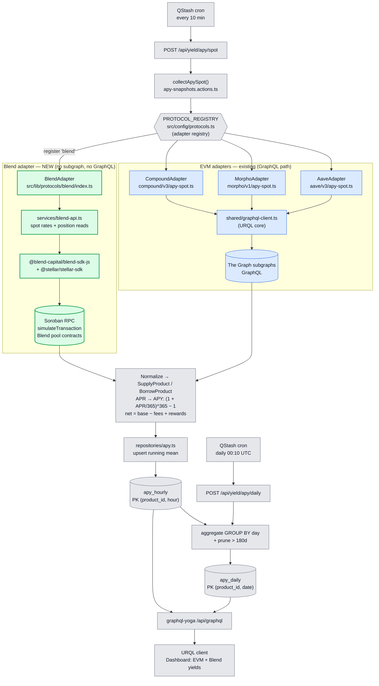
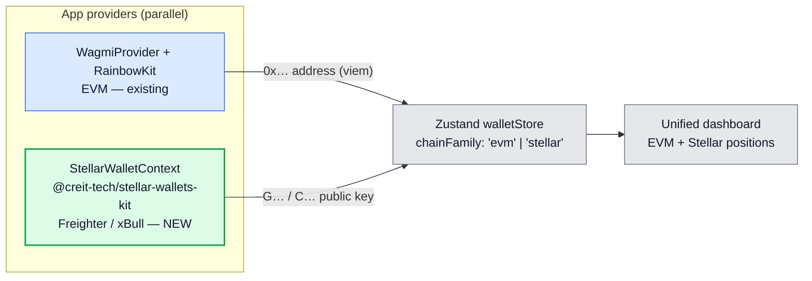

# LendWise — Protocol Processing Flow & Blend Integration

> **Legend** — green = NEW bricks added for Stellar/Blend ·
> blue = existing EVM pipeline (unchanged) · grey = shared core (unchanged).

---

## 1. Data processing flow — current EVM protocols + Blend addition

**Reading the diagram**

- The trigger, registry, normalization, `apy_hourly`/`apy_daily`, and the GraphQL serving layer
  are **shared and unchanged** — they are protocol-agnostic by design.
- Existing EVM protocols read through **The Graph subgraphs** via the shared URQL GraphQL client.
- **Blend has no subgraph**, so the new adapter **bypasses GraphQL entirely**: it reads pool
  rates and user positions from **Soroban contracts** through the **Blend SDK** over **Soroban RPC**
  (`simulateTransaction`), then hands normalized `SupplyProduct`/`BorrowProduct` objects to the
  same pipeline.
- Adding Blend = register `'blend'` in `PROTOCOL_REGISTRY` + ship the green bricks. Nothing in the
  blue/grey path changes.

---

## 2. Wallet layer — multi-ecosystem coexistence

**New bricks (green):** `@creit-tech/stellar-wallets-kit` + a `StellarWalletContext` running
**alongside** `WagmiProvider`, feeding the existing Zustand `walletStore` once it carries a
`chainFamily` discriminator. EVM wallet flow is untouched.

---

## 3. New vs existing — at a glance

| Brick                         | Status   | Library / path                                                          |
| :---------------------------- | :------- | :---------------------------------------------------------------------- |
| Adapter registry              | existing | `PROTOCOL_REGISTRY` — `src/config/protocols.ts`                         |
| Spot collection               | existing | `collectApySpot()` — `apy-snapshots.actions.ts`                         |
| EVM data source               | existing | The Graph subgraphs via `shared/graphql-client.ts` (URQL)               |
| `apy_hourly` / `apy_daily`    | existing | `repositories/apy.ts` + Drizzle schema                                  |
| GraphQL serving               | existing | `graphql-yoga` `/api/graphql`                                           |
| **Blend adapter**             | **NEW**  | `src/lib/protocols/blend/`                                              |
| **Blend data source**         | **NEW**  | `@blend-capital/blend-sdk-js` + `@stellar/stellar-sdk` over Soroban RPC |
| **Stellar wallet**            | **NEW**  | `@creit-tech/stellar-wallets-kit` + `StellarWalletContext`              |
| **`chainFamily` store field** | **NEW**  | `src/stores/walletStore.ts`                                             |
