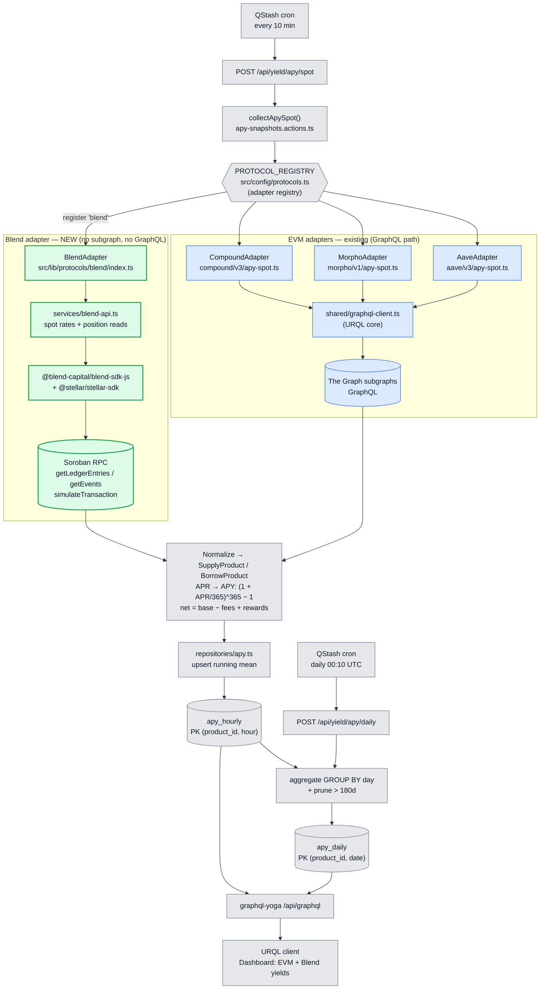
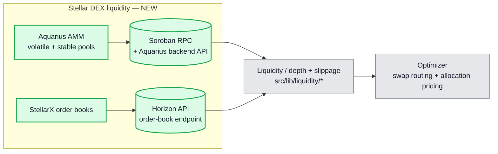
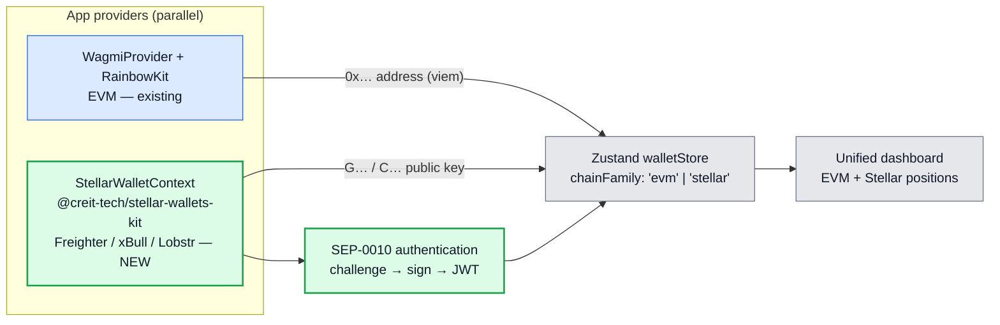
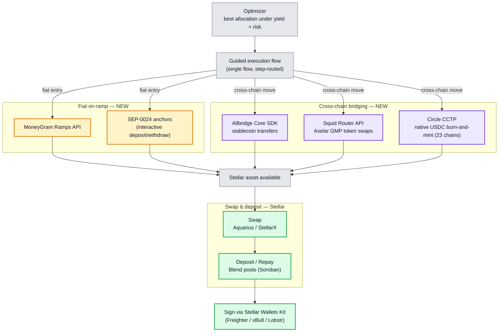
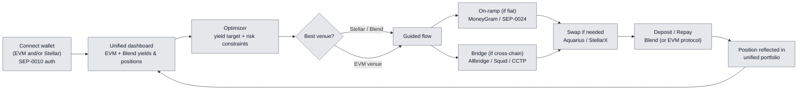

# LendWise — Stellar Cross-Chain Integration Architecture

> **Scope** — the full Stellar integration across all five layers from the validated SCF entry:
> Blend lending data, Aquarius/StellarX DEX liquidity, Allbridge/Squid/CCTP bridging,
> MoneyGram/SEP-0024 on-ramp, and Freighter/xBull/Lobstr wallet connectivity (SEP-0010 auth).
>
> **Legend** — green = NEW bricks added for Stellar ·
> blue = existing EVM pipeline (unchanged) · grey = shared core (unchanged) ·
> purple = cross-chain execution ·
> amber = fiat on-ramp.

The integration spans three functional planes:

- **Read plane** — ingest lending rates (Blend) and DEX liquidity (Aquarius, StellarX).
- **Wallet & auth plane** — connect/sign with Stellar wallets, authenticate via SEP-0010.
- **Execution plane** — on-ramp fiat, bridge cross-chain, swap, then deposit/repay on Blend.

---

## 1. Read plane — lending-rate ingestion (EVM + Blend)

**Reading the diagram**

- The trigger, registry, normalization, `apy_hourly`/`apy_daily`, and the GraphQL serving layer
  are **shared and unchanged** — they are protocol-agnostic by design.
- Existing EVM protocols read through **The Graph subgraphs** via the shared URQL GraphQL client.
- **Blend has no subgraph**, so the new adapter **bypasses GraphQL entirely**: it reads pool
  state (`getLedgerEntries`), indexes position events (`getEvents`), and simulates reads
  (`simulateTransaction`) from **Soroban contracts** through the **Blend SDK**, then hands
  normalized `SupplyProduct`/`BorrowProduct` objects to the same pipeline.
- Adding Blend = register `'blend'` in `PROTOCOL_REGISTRY` + ship the green bricks. Nothing in the
  blue/grey path changes.

---

## 2. Read plane — DEX liquidity (Aquarius, StellarX)

**New bricks (green):** Aquarius volatile/stable AMM pools read via **Soroban RPC + the Aquarius
backend API**, and StellarX order books read via the **Horizon** order-book endpoint. Both feed
the optimizer so cross-asset Stellar allocations are priced from **real on-chain liquidity**, not
estimates, and so the swap leg of the execution flow has accurate slippage.

---

## 3. Wallet & auth plane — multi-ecosystem coexistence

**New bricks (green):** `@creit-tech/stellar-wallets-kit` + a `StellarWalletContext` running
**alongside** `WagmiProvider`, covering **Freighter, xBull, and Lobstr** through one signing
interface. **SEP-0010** authenticates the connected key (challenge → sign → session). Both feed
the existing Zustand `walletStore` once it carries a `chainFamily` discriminator. EVM wallet flow
is untouched.

---

## 4. Execution plane — on-ramp, bridge, swap, deposit

**Reading the diagram**

- The optimizer produces a target allocation; the **guided execution flow** routes the steps
  needed to reach it in one place.
- **On-ramp (amber):** new users enter from fiat via the **MoneyGram Ramps API** or **SEP-0024**
  anchors, landing a Stellar asset ready to deploy.
- **Bridging (purple):** existing capital moves between EVM and Stellar via **Allbridge Core**
  (stablecoins), **Squid Router** (Axelar GMP swaps), or **Circle CCTP** (native USDC
  burn-and-mint across 23 chains, no wrapped-asset risk) — route chosen per asset/chain/cost.
- **Swap & deposit (green):** the Stellar asset is swapped via Aquarius/StellarX if needed, then
  supplied/repaid on Blend pools, with every transaction **signed through Stellar Wallets Kit**.

---

## 5. End-to-end cross-chain user journey

This is the single guided flow the product promises: **connect → compare → optimize → execute**,
with Stellar/Blend as a first-class venue ranked next to EVM markets and reachable from fiat or
from any of 23 chains.

---

## 6. New vs existing — at a glance

| Brick                          | Status   | Library / path                                                          |
| :----------------------------- | :------- | :---------------------------------------------------------------------- |
| Adapter registry               | existing | `PROTOCOL_REGISTRY` — `src/config/protocols.ts`                         |
| Spot collection                | existing | `collectApySpot()` — `apy-snapshots.actions.ts`                         |
| EVM lending data               | existing | The Graph subgraphs via `shared/graphql-client.ts` (URQL)               |
| `apy_hourly` / `apy_daily`     | existing | `repositories/apy.ts` + Drizzle schema                                  |
| GraphQL serving                | existing | `graphql-yoga` `/api/graphql`                                           |
| **Blend lending adapter**      | **NEW**  | `src/lib/protocols/blend/`                                              |
| **Blend data source**          | **NEW**  | `@blend-capital/blend-sdk-js` + `@stellar/stellar-sdk` over Soroban RPC |
| **DEX liquidity — Aquarius**   | **NEW**  | `src/lib/liquidity/aquarius.ts` — Soroban RPC + Aquarius API            |
| **DEX liquidity — StellarX**   | **NEW**  | `src/lib/liquidity/stellarx.ts` — Horizon order-book endpoint           |
| **Stellar wallet + SEP-0010**  | **NEW**  | `@creit-tech/stellar-wallets-kit` + `StellarWalletContext`              |
| **`chainFamily` store field**  | **NEW**  | `src/stores/walletStore.ts`                                             |
| **Bridge — Allbridge Core**    | **NEW**  | `src/lib/execution/bridge/allbridge.ts` — Allbridge Core SDK            |
| **Bridge — Squid / Axelar**    | **NEW**  | `src/lib/execution/bridge/squid.ts` — Squid Router API (Axelar GMP)     |
| **Bridge — Circle CCTP**       | **NEW**  | `src/lib/execution/bridge/cctp.ts` — native USDC burn-and-mint          |
| **On-ramp — MoneyGram/SEP-24** | **NEW**  | `src/lib/execution/onramp.ts` — MoneyGram Ramps + SEP-0024 anchors      |
