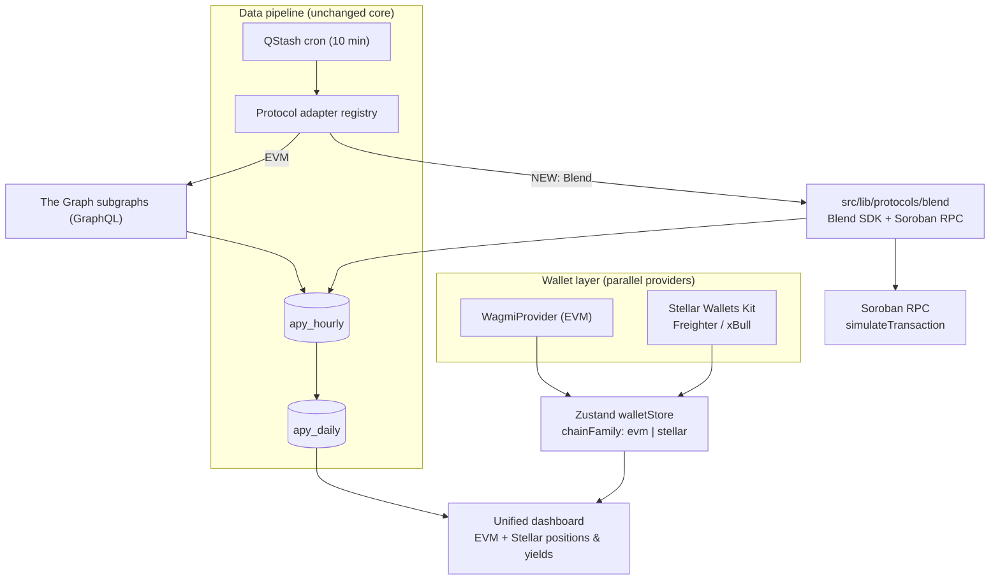

# LendWise — SCF Build Award Submission

> Working draft of the SCF Build Award form answers. Project name: **LendWise**.
> Total request: **$90,000** in XLM over ~4 months. Team: 3+.
> Tranche release (fixed SCF structure): T0 10% = $9,000 · T1 20% = $18,000 · T2 30% = $27,000 · T3 40% = $36,000.

---

## 1. Submission Title

> _Max 40 characters. Must differ from the project name and reflect what the funding is for._

**Primary choice:**

```
Yield Aggregation for Stellar's Blend
```

(38 characters)

**Alternatives:**

- `Stellar Yield Layer for Soroban Lending` (39)
- `Cross-Chain Yield Optimizer for Blend` (37)
- `Bringing DeFi Yield Data to Soroban` (35)

---

## 2. Technical Architecture

> _Paste an accessible link here (GitBook / public GitHub README / Notion). The full write-up below is ready to publish — host it, then add the URL._
>
> **Link:** `<add public URL here>`

### 2.1 Context — what LendWise already is

LendWise is a production DeFi yield-aggregation platform that compares supply and borrow
positions across **Aave V3, Morpho Blue/MetaMorpho, and Compound V3** on five EVM chains
(Ethereum, Polygon, Arbitrum, Base, Optimism). It is built on a deliberately modular core:

- A **protocol-adapter registry** (`src/config/protocols.ts`) where each protocol is an
  isolated module exposing a common interface — adding a protocol does not touch the others.
- A **data pipeline**: a QStash cron (every 10 min) calls protocol adapters, normalizes the
  result to APY, and upserts a running mean into `apy_hourly` (Postgres / Neon + Drizzle).
  A daily cron aggregates `apy_hourly → apy_daily` with a single `GROUP BY`.
- `Promise.allSettled` everywhere multiple sources are aggregated, so one failing source
  never blocks the others.

This architecture is **non-EVM-ready by design** — the EVM assumption lives only inside the
adapters and the wallet layer, not in the pipeline or the database schema.

### 2.2 Why Stellar/Blend needs new modules (and what is reusable)

| Layer | EVM today | Reusable for Stellar/Blend? |
| :-- | :-- | :-- |
| Wallet | Wagmi + RainbowKit, `viem` `Address` (`0x…`) | **No** — Stellar uses `G…`/`C…` keys, no `window.ethereum` |
| Data fetch | The Graph subgraphs via URQL/GraphQL | **No** — Blend has no subgraph; reads come from Soroban contracts |
| Pipeline & DB | `apy_hourly` / `apy_daily`, adapter registry | **Yes** — schema and ingestion are protocol-agnostic |

The conclusion: keep the pipeline and database untouched; add **one new wallet ecosystem**
and **one new (non-GraphQL) protocol adapter**.

### 2.3 Stellar integration design

**Wallet — multi-ecosystem coexistence**

- Integrate **Stellar Wallets Kit** (`@creit-tech/stellar-wallets-kit`,
  https://stellarwalletskit.dev/) focused on **Freighter** and **xBull**.
- Add a `StellarWalletContext` that runs **in parallel** with the existing `WagmiProvider`.
- Extend the unified Zustand `walletStore` from `isBitcoin: boolean` to a
  `chainFamily: 'evm' | 'stellar' | 'bitcoin'` discriminator, and relax the `viem` `Address`
  constraint in the multi-chain zones so Stellar keys validate.

**Data — Blend adapter on Soroban RPC**

- New adapter `src/lib/protocols/blend/` that **bypasses GraphQL**.
- Reads pool state and rates with the official **Blend SDK**
  (`@blend-capital/blend-sdk-js`) over **Soroban RPC** (`simulateTransaction`), with the
  Blend REST API as a fallback for spot rates.
- Reads a connected user's **on-chain positions** (supplied, borrowed, collateral, health
  factor) via RPC simulation against the Blend pool contracts.
- Normalizes everything to the existing `SupplyProduct` / `BorrowProduct` types, converts
  APR → APY `(1 + APR/365)^365 − 1`, and feeds the **unchanged** `apy_hourly` upsert.

**Tooling**

- **Scaffold Stellar** for project scaffolding and any contract-interaction stubs.
- **Stellar Lab** (https://lab.stellar.org/) to build and validate the read-path PoC against
  testnet before wiring it into the cron.

### 2.4 Data & control flow



### 2.5 New module layout

```
src/
├── config/
│   └── protocols.ts            # register 'blend' in SUPPORTED_PROTOCOLS
├── contexts/
│   └── StellarWalletContext.tsx  # parallel to WagmiProvider
├── stores/
│   └── walletStore.ts          # chainFamily discriminator
└── lib/
    └── protocols/
        └── blend/
            ├── index.ts        # adapter (DataAdapter interface) — getAccountPositions
            ├── config.ts       # Soroban RPC endpoints, Blend pool addresses
            └── services/
                └── blend-api.ts # Blend SDK / REST spot-rate + position reads
```

### 2.6 Stack additions

`@creit-tech/stellar-wallets-kit` · `@blend-capital/blend-sdk-js` · `@stellar/stellar-sdk`
(Soroban RPC). No change to Next.js, Postgres/Drizzle, the cron, or the GraphQL server.

---

## 3. Products and Services

This submission brings LendWise's yield aggregation to **Stellar**, starting with **Blend** —
LendWise's **first non-EVM protocol**.

**a) Blend yield-data ingestion**
A new protocol adapter reads Blend supply/borrow APYs directly from Soroban contracts via the
Blend SDK and Soroban RPC, normalizes them to APY, and feeds the existing hourly/daily
pipeline.
_Stellar:_ Soroban RPC `simulateTransaction` + Blend SDK as the data source (no subgraph).
_Impact:_ Stellar/Blend rates appear next to EVM protocols in the same comparison surface —
LendWise's first non-EVM coverage.

**b) Stellar wallet connection (Freighter, xBull)**
A parallel wallet context built on Stellar Wallets Kit, unified into LendWise's existing
multi-chain store.
_Stellar:_ Stellar Wallets Kit handles `G…`/`C…` keys and signing.
_Impact:_ Stellar-native users connect and use LendWise without disturbing EVM flows.

**c) On-chain Blend position aggregation**
Reads a user's real Blend positions (supplied, borrowed, collateral, health factor) and merges
them into a single cross-chain portfolio.
_Stellar:_ Soroban RPC simulation against Blend pool contracts.
_Impact:_ One unified view of a user's positions across EVM and Stellar.

**d) Cross-chain yield comparison / optimizer surfacing**
Blend yields are ranked alongside EVM venues for the same asset.
_Stellar:_ Blend net APY (base − fees + rewards) computed from on-chain state.
_Impact:_ Routes user attention and liquidity toward Stellar opportunities, growing Blend usage.

---

## 4. SCF Build Tranche Deliverables

> Tranche **#0** (10% = **$9,000**) releases on approval — project kickoff, Soroban/Blend
> testnet environment setup, and Stellar Wallets Kit integration spike. No standalone
> deliverable.
> Deliverable budgets below are rounded to the hundred and sum to each tranche's total.
> _No marketing/promotion budget. No audit budget (audit credits arrive with Tranche #3)._

---

### Tranche 1 — MVP (Blend data + Stellar wallet) — total $18,000

**Deliverable 1.1 — Blend data adapter & yield ingestion**

- **Brief description:** New non-GraphQL adapter at `src/lib/protocols/blend` using
  `@blend-capital/blend-sdk-js` over Soroban RPC to fetch Blend supply/borrow APYs on testnet,
  normalize them to the `SupplyProduct`/`BorrowProduct` shape (APR → APY), and feed the
  existing `apy_hourly` pipeline.
- **How to measure completion:** Blend supply and borrow APYs for a live pool (e.g., a Blend
  USDC pool) land in `apy_hourly` via the existing cron endpoint and render in the LendWise UI
  next to the EVM protocols.
- **Estimated date of completion:** ~mid-August 2026
- **Budget:** $9,600

**Deliverable 1.2 — Stellar wallet connection (Freighter, xBull)**

- **Brief description:** Integrate Stellar Wallets Kit, add a `StellarWalletContext` running
  alongside `WagmiProvider`, and extend the unified `walletStore` with a `chainFamily`
  discriminator so Stellar keys persist without breaking EVM typing.
- **How to measure completion:** A user can connect a Stellar wallet (e.g., Freighter or xBull),
  the public key persists in the unified store, and the connected address shows in the UI while
  existing EVM wallet connection still works.
- **Estimated date of completion:** ~mid-August 2026
- **Budget:** $8,400

---

### Tranche 2 — On-chain positions + historical pipeline — total $27,000

**Deliverable 2.1 — On-chain Blend position reader**

- **Brief description:** Read a connected user's actual Blend positions (supplied, borrowed,
  collateral, health factor) via Soroban RPC `simulateTransaction` through the Blend SDK, mapped
  to LendWise position types.
- **How to measure completion:** For a test account with an open Blend position on testnet, the
  user's supplied/borrowed balances and health factor display in the portfolio view.
- **Estimated date of completion:** ~end September 2026
- **Budget:** $9,800

**Deliverable 2.2 — Blend historical APY pipeline (hourly → daily)**

- **Brief description:** Wire Blend into the spot and daily cron jobs using the same net-rate
  semantics and the existing `apy_hourly → apy_daily` aggregation and quality/completeness
  scoring.
- **How to measure completion:** Blend rows accumulate in `apy_hourly` across the cron cadence
  and aggregate into `apy_daily`; a historical APY chart for a Blend pool (e.g., a USDC pool)
  renders from stored data.
- **Estimated date of completion:** ~end September 2026
- **Budget:** $9,400

**Deliverable 2.3 — Unified cross-chain portfolio view**

- **Brief description:** Merge Stellar/Blend positions with EVM positions in one dashboard,
  aggregated with `Promise.allSettled` so a Stellar source failure never blocks EVM and vice
  versa.
- **How to measure completion:** A dashboard shows positions from at least one EVM protocol and
  from Blend at the same time for a user connected to both ecosystems, and degrades gracefully
  when one source fails.
- **Estimated date of completion:** ~end September 2026
- **Budget:** $7,800

---

### Tranche 3 — Mainnet launch + optimizer surfacing — total $36,000

**Deliverable 3.1 — Mainnet Blend coverage**

- **Brief description:** Point the adapter at Stellar mainnet RPC and the live Blend pools, and
  run production cron ingestion.
- **How to measure completion:** Live mainnet Blend supply/borrow APYs ingest on the production
  cron and display to users, persisting through the hourly/daily pipeline in production.
- **Estimated date of completion:** ~mid-November 2026
- **Budget:** $13,200

**Deliverable 3.2 — Cross-chain yield comparison / optimizer surfacing**

- **Brief description:** Surface Blend yields inside the comparison/optimizer so users see
  Stellar opportunities ranked against EVM venues for the same asset.
- **How to measure completion:** For a given asset (e.g., USDC), the comparison view ranks Blend
  alongside EVM venues by net APY, and selecting Blend deep-links the user to act on it.
- **Estimated date of completion:** ~mid-November 2026
- **Budget:** $12,400

**Deliverable 3.3 — Production launch, public docs & user-testing handoff**

- **Brief description:** Production deployment of the Stellar/Blend integration, public
  documentation of the integration, and monitoring/gap-heal coverage extended to the Blend
  pipeline — ready for professional user testing.
- **How to measure completion:** The Stellar/Blend integration is live on the production domain,
  publicly documented, reachable by end users, and included in the pipeline monitoring reports.
- **Estimated date of completion:** ~mid-November 2026
- **Budget:** $10,400

---

### Budget summary

| Tranche | Release trigger | % | Amount |
| :-- | :-- | --: | --: |
| #0 | Upon approval | 10% | $9,000 |
| #1 | MVP delivered | 20% | $18,000 |
| #2 | Positions + history delivered | 30% | $27,000 |
| #3 | Mainnet launch + user testing | 40% | $36,000 |
| **Total** | | **100%** | **$90,000** |
